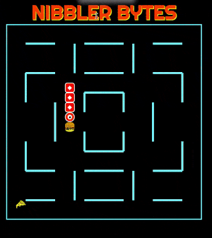
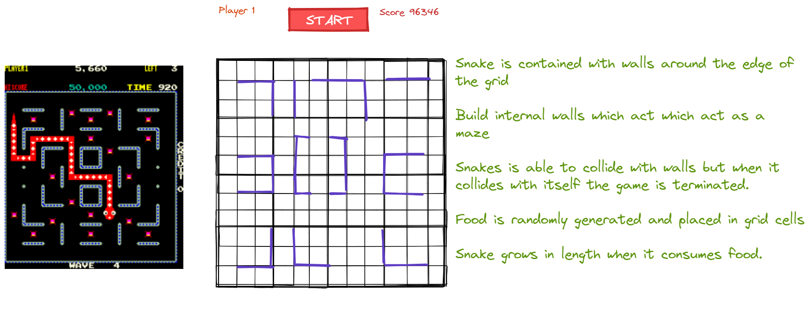
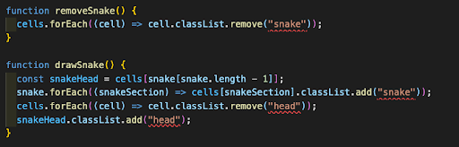
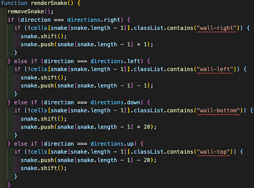
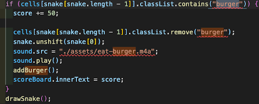

# Nibbler-Bytes

The Nibbler is an intergalactic reptilian alien with an insatiable appetite. He likes a varied diet but has found a particular taste for pizza and hamburgers since his arrival on Earth.

### Instructions

<li>Clear the maze by eating the food</li>
<li>DO NOT let Nibbler bite itself!</li>
<li>Nibbler does not stop at corners</li>
<li>Nibbler grows longer when it eats</li>

## ProjectOverview

Nibbler Bytes was born out of a documentary I had seen about the arcade game of a similar name. When I learned of the first SEI project to make a grid based game with vanilla JavaScript this is what initially sprang to mind. This project was the first time to apply everything I had learned in the opening few weeks of the SEI course.

[Play Game Here](https://beltonjohn.github.io/ga-project-1/)

### Duration:

7days

### Technologies Used

HTML, CSS, JavaScript.

## The Brief

The brief was to create a grid-based game using only JavaScript, CSS, and HTML.

requisite features specifically for a snake game were as follows:

<li>The snake should grow when it eats a piece of food</li>
<li>The snake should speed up when it eats a pice of food</li>
<li>The snake should grow in length when it eats a piece of food</li>

## Initial Steps

I initially created sketches using Excalidraw, which is shown below. I also started pseudocoding the steps needed to make an MVP which in my mind was a moving snake in a grid.

### Day 2

I had difficulty rendering the snake on the screen until I realised that I hadn’t targeted it properly in CSS and given it a different colour to the grid. After this I added the event listener for the keypresses and tried to write a function which would move the snake. This was problematic for me and the snake appeared to be moribund; DEAD ON ARRIVAL! After a lot of research and little progress with the functionality of the game I decided to add some styling before taking a break from the computer.

### Day 3

After talking with a fellow colleague working on a completely different game, I realised my error, which was not writing a function to render the snake on the screen. Below is the final iteration of the drawSnake function and removeSnake function, which was needed to not have a snake that grew indefinitely.

### Day 4

I erroneously abandoned my whiteboard plan to think of the snake as an array of numbers in the grid. What I ended up with was a funky looking and weird moving “snake”. I therefore had to rewind to my original plan, which was to use .push() .shift() to move the snake.

I also had to ask my tutor for help to build extra functionality which would prevent the snake from moving through the internal walls. Below is the final logic for this functionality, which I think was one of the most difficult parts of this project.

### Day 5

My goals for the day were getting random food to generate in the grid and for the snake to eat the food. I realised I’d have to use a while loop to get the food to only generate in grid cells not already occupied by the snake. Progress was painstakingly slow and nothing seemed to appear in the grid cells. After having a second pair of eyes look at the code with me it became apparent that the problem was in fact down to a missing point in my CSS class for the food. This was stopping my querySelector fetching the CSS class. I decided to take a break after having little success thereafter, when the snake was unable to eat any food.

### Day 6

This was a much more productive day, in my break from the code I had an epiphany as to why the snake wouldn’t eat. I jumped back to my machine and tried something different, which was to remove the CSS class of burger when the snake’s head was occupying the same grid cell. After returning the addBurger function within my eatBurger logic I had a self-sustaining food system. I also got the snake to grow one segment at a time in the same function (pictured).

A second issue arose from this which was related to the renderSnake function which meant the snake would be unable to pass through a wall when entering from one direction but free to pass when entering from another. The solution was to simply double up the number of walls. This process was a labour of love and resulted in over 200 lines of code, however I found it quite enjoyable and l learnt about modulus along the way.

### Day 7

Progress slowed on the final day but I got a function working which would speed up the snake as it ate and a scoreboard which updated as it ate food. In addition to this I added some extra features such as a start game button, a second food powerup which was a pizza that provided additional points without speeding the snake up and also some improved styling.

## Bugs

There was a bug relating to the random placement of food in the grid and the internal walls I had created. Initially the maze had a solid square in the centre which the Nibbler was unable to enter, however the food would randomly be placed there. This could have been fixed with an if statement within the addBurger and addPizza functions. However I chose to remove two of the walls therefore allowing the Nibbler access to all areas.

Another bug is related to the collision function and I believe it’s because the “head” of the snake is [.length -1] instead of being [0] in the array If I were to remake this game I would definitely change this.

## Wins

The project as a whole was a win for me, it gave me a more in depth understanding of a lot of key concepts within JavaScript. However some particular things I was proud of are the internal walls of the maze which was time consuming and also the movement of the snake, which was quite challenging. I think the end result is a smooth moving snake which renders quite nicely.

## Challenges

The most difficult of the project was undoubtedly when I tried to animate the snake. While trying to find a solution or some guidance online, I became quite disheartened. I’d read numerous posts on Stackoverflow and tried to implement different solutions to no avail. The realisation came when talking with a fellow colleague about a completely different game they were developing (shown below).

## Key Learnings

- A deeper understanding of the fundamentals of JavaScript
- Improved ability to write functions, if statements and loops
- The importance of planning and pseudocoding and to sick with those plans
- How to plan my work accordingly in order to deliver a minimum viable product on time
- How to work independently and solve problems by asking the right questions to google and Stack Overflow.

## Future Improvements

If I were to continue developing this game further, I would like to add a popup when a certain score is reached by the player. They could then click through to the next level which would have a different maze. This could be extrapolated for numerous different levels. However, I think I'd realistically add 4 more levels. Secondly I’d like to go back and fix the self collision bug and make sure the game functions perfectly.
